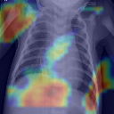
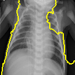
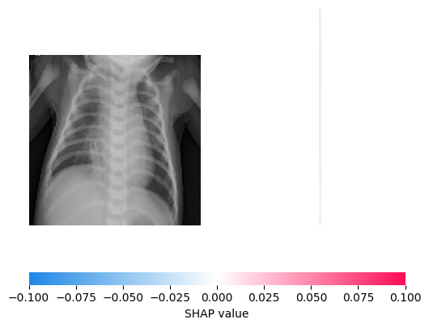
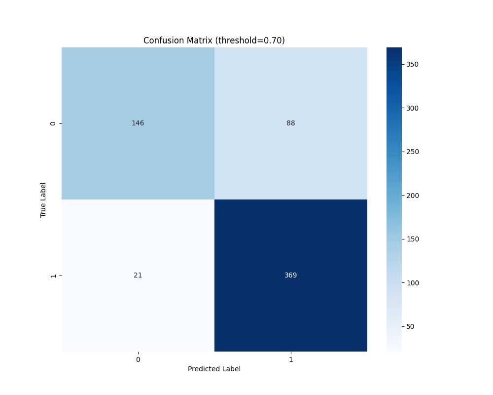
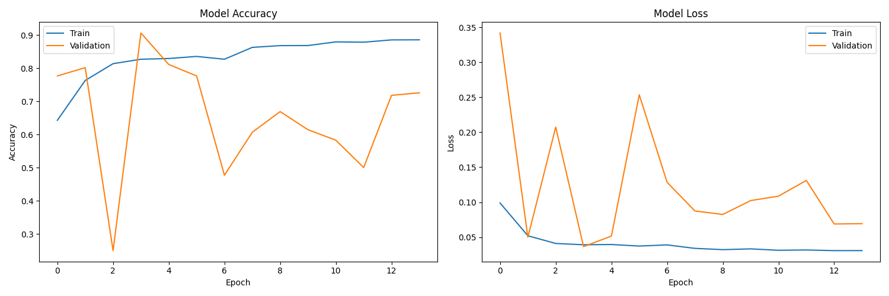

# Medical Image Analysis: Detecting Pneumonia in Chest X-Rays with XAI

This project focuses on developing and evaluating a deep learning model for the detection of pneumonia in chest X-ray images. A hybrid Convolutional Neural Network (CNN) and Long Short-Term Memory (LSTM) architecture is employed. To enhance the model's interpretability and trustworthiness, Explainable Artificial Intelligence (XAI) techniques are integrated.

## Project Overview

- **Task:** Binary classification of chest X-ray images into "Normal" and "Pneumonia" classes.
- **Model:** A hybrid CNN-LSTM architecture, combining the spatial feature extraction of CNNs with the temporal processing capabilities of LSTMs.
- **XAI Techniques:** Grad-CAM, LIME, and SHAP, used to provide insights into the model's decision-making process.
- **Dataset:** "Chest X-Ray Images (Pneumonia)" dataset from Kaggle, consisting of pediatric chest X-rays.

## Dataset

The dataset used for this project is the "Chest X-Ray Images (Pneumonia)" dataset available on Kaggle:

- **Link:** [https://www.kaggle.com/datasets/paultimothymooney/chest-xray-pneumonia](https://www.kaggle.com/datasets/paultimothymooney/chest-xray-pneumonia)
- **Description:**
  - Contains 5,863 chest X-ray images in JPEG format.
  - Images are from pediatric patients aged 1-5 years.
  - Divided into "Normal" and "Pneumonia" classes, with pneumonia further categorized as Bacterial or Viral.
  - Organized into three folders: training, testing, and validation.
  - Images were collected from Guangzhou Women and Children's Medical Center, China and obtained through routine clinical care.
- **Quality Assurance:**
  - Initial screening to remove low-quality images.
  - Diagnostic validation by two expert physicians.
  - Additional verification of the evaluation set by a third expert.

## Model Architecture

The model consists of two main parts: a CNN for spatial feature extraction and an LSTM for processing sequential information. Here's a breakdown:

**CNN Component:**

- Three convolutional blocks, each with Conv2D, BatchNormalization, ReLU activation, MaxPooling2D, and Dropout layers.
- First block uses 32 filters, the second 64, and the third 128.

**LSTM Component:**

- The output of the CNN is reshaped and fed into two LSTM layers.
- The first LSTM layer has 256 units, and the second 128 units, each with batch normalization and dropout.

**Dense Component:**

- Two dense layers with ReLU activation and Dropout, followed by a final output layer with a sigmoid activation function.

**Architecture Details:**

```
Input: Grayscale Images (128x128x1)
Data Augmentation: Random Flips, Rotations, Zoom, Translation
CNN Blocks:
    Block 1: 32 filters -> BatchNorm -> ReLU -> MaxPool -> Dropout(0.2)
    Block 2: 64 filters -> BatchNorm -> ReLU -> MaxPool -> Dropout(0.3)
    Block 3: 128 filters -> BatchNorm -> ReLU -> MaxPool -> Dropout(0.4)
Feature Reshape: Transform to (16, 2048) sequence
LSTM Blocks:
    LSTM 1: 256 units -> BatchNorm -> Dropout(0.4)
    LSTM 2: 128 units -> BatchNorm -> Dropout(0.4)
Dense Layers:
    Dense(256) -> BatchNorm -> ReLU -> Dropout(0.5)
    Dense(128) -> BatchNorm -> ReLU -> Dropout(0.5)
Output: Dense(1) -> Sigmoid
```

**Model Statistics:**

- **Total Parameters:** 2,720,129 (~10.38 MB)
- **Trainable Parameters:** 2,718,145 (~10.37 MB)
- **Non-trainable Parameters:** 1,984 (~7.75 KB)

## Training Configuration

- **Loss Function:** Custom Focal Loss (gamma=2.0, alpha=0.5)
- **Optimizer:** Adam (initial learning rate: 0.001)
- **Metrics:** Accuracy, Precision, Recall, AUC
- **Learning Rate Schedule:** ReduceLROnPlateau
- **Early Stopping:** Monitors validation loss with 10 epochs patience
- **Class weighting:** Implemented to handle class imbalance

## XAI Analysis

The project implements three XAI techniques:

- **Grad-CAM:** Generates a heatmap highlighting the regions of the input image that are most important for the model's prediction. For example, below is a Grad-CAM output for `person117_bacteria_556_gradcam.png` located in the `pics` folder

  

- **LIME:** Provides local explanations by creating a simpler model around the input image, highlighting superpixels that contributed most to the prediction. Below is a LIME output for `person117_bacteria_556_lime.png` located in the `pics` folder

  

- **SHAP:** Calculates Shapley values to explain how each feature (pixel) contributes to the prediction, indicating both the direction and magnitude of influence. Below is a SHAP output for `person117_bacteria_556_shap.png` located in the `pics` folder

  

## Model Performance

- The model achieved a test set accuracy of 0.85.
- A detailed breakdown of the model's performance including precision, recall, and F1-score are included in the final classification report.
- The model training included learning rate reduction, early stopping, and saving the best performing model, resulting in robust performance.

Here's a confusion matrix located in the `pics` folder:


And also a the training history:


## Files

- **`train_and_evaluate.py`**: Contains the code for training and evaluating the deep learning model. This file includes data loading, preprocessing, model definition, training loop, and performance evaluation.
- **`xai_analysis.py`**: Contains code for generating explanations using Grad-CAM, LIME, and SHAP.
- **`requirements.txt`**: This file is crucial for specifying the dependencies needed to run your code.
- **`best_model.keras`**: This file contains the trained weights, essential if you want people to use your model directly without retraining.
- **`pics`**: A folder with all the visualization images used to explain this project.

## How to Use

1.  Clone this repository to your local machine:
    ```bash
    git clone https://github.com/Psychellic/Pneumonia-Detection
    ```
2.  Ensure you have the necessary libraries installed. You can install required packages with pip using:
    ```bash
    pip install -r requirements.txt
    ```
3.  Place the `chest_xray` dataset directory in the same directory as the python scripts.
4.  Run `train_and_evaluate.py` to train the model. This script will also save the best model to `best_model.keras`.
5.  Run `xai_analysis.py` to generate the XAI visualizations.

## Results

- The final classification report, along with the confusion matrix can be found in the source code output, showing strong performance.

- XAI visualizations are provided for selected images to understand the model's reasoning. This output includes Grad-CAM, LIME, and SHAP outputs.
